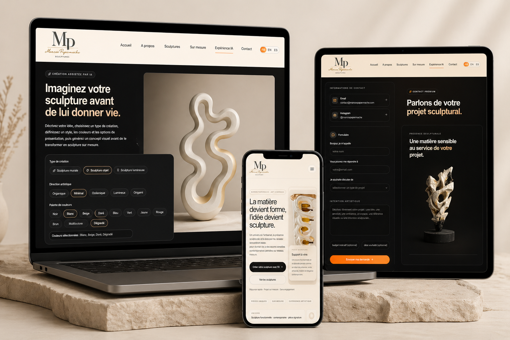
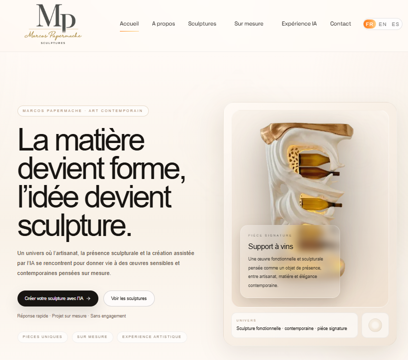
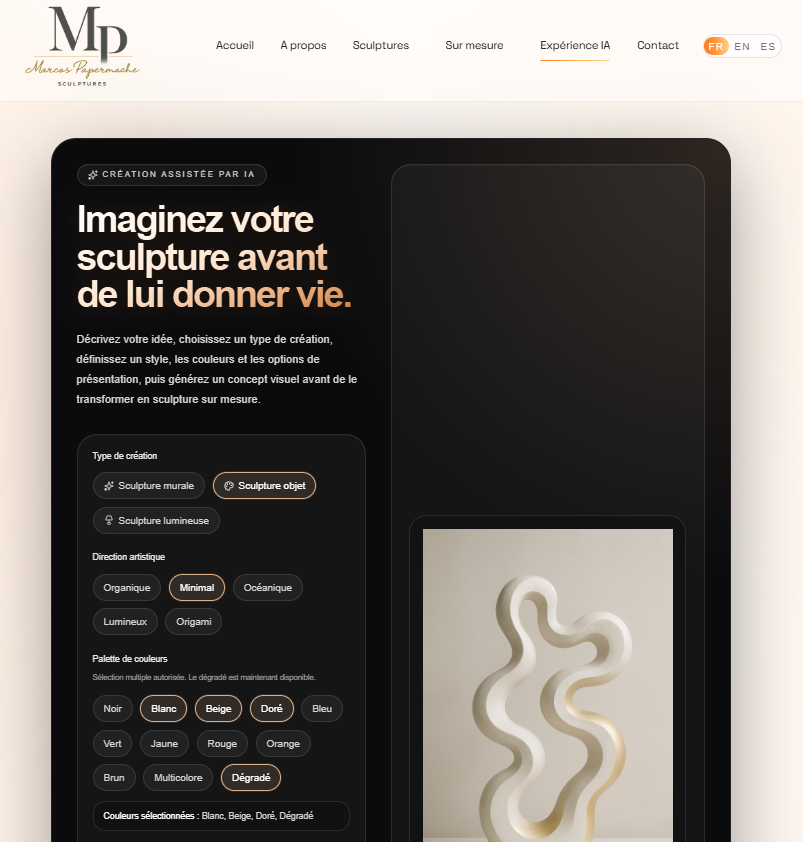
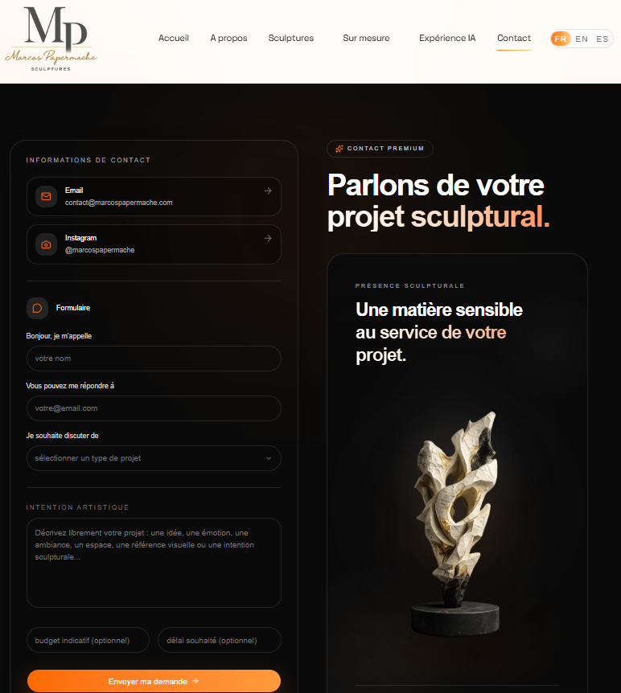

# Marcos Papermache

Premium handcrafted sculptures with an AI-powered creative experience.

## 🌐 Live Website

https://www.marcospapermache.com

## ✨ Concept

An immersive digital experience where users can:

* Describe an idea
* Generate a visual concept using AI
* Customize the style, format and details
* Turn it into a real handcrafted sculpture

## 🎨 Features

* AI image generation (custom prompts)
* Multiple creation types (wall, object, light)
* Premium UI/UX with animations
* Custom order workflow

## 🛠️ Tech Stack

* Next.js
* Supabase
* OpenAI API
* Tailwind CSS
* Framer Motion

## ⚠️ Note

Some environment variables and backend logic are hidden for security reasons.

## 📸 Preview

## ✨ Preview

### Homepage

### Homepage

### Contact

